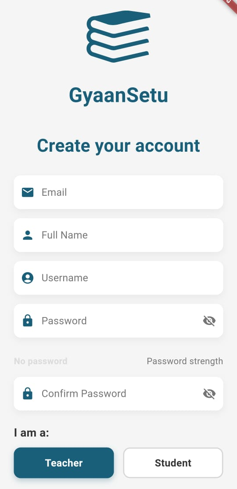

# GyaanSetu  
**Learning App for Deaf and Mute with Sign Language English/Gujarati Converter**  

### Table of Contents  
- [About the Project](#about-the-project)  
- [Features](#features)  
- [Tech Stack](#tech-stack)  
- [Screenshots](#screenshots)  
- [Setup Instructions](#setup-instructions)  
- [Acknowledgments](#acknowledgments)  

---

## About the Project  
GyaanSetu is an educational mobile application designed to support inclusivity for deaf and mute students. The app provides features to help users learn and practice alphabets, numbers, words, sentences, and basic mathematics in Gujarati and English. Additionally, it integrates **Indian Sign Language (ISL)** for effective communication.

This project was developed as part of the **Smart India Hackathon 2024**, where it cleared the internal college hackathon.

---

## Features  
- **Dual-Language Support**: Learning materials in Gujarati and English.  
- **Indian Sign Language Integration**: Helps students understand alphabets and words using ISL.  
- **Writing Pad**: Practice writing alphabets, numbers, and words.  
- **Assessment Tools**: Offers quizzes to track learning progress.  

---

## Tech Stack  
- **Frontend**: Flutter  
- **UI/UX Design Tools**: Figma  
- **Backend**: Firebase
- **Programming Language**: Dart  
- **Version Control**: Git and GitHub  

---

## Screenshots 
### Signup Screen  

### Login Screen  
  

### Home Screen  
 

### Courses Page  
  

### Whiteboard Page  
 

### Games Main Page  
 

There are various other pages too for which the screenshots have been added in the assets/readme folder.

---

## Setup Instructions  
Follow these steps to set up and run the project locally:

1. **Clone the Repository**:  
   git clone https://github.com/RonakAjwani/GyaanSetu.git
   cd GyaanSetu

2. **Install Flutter**:  
   Ensure you have Flutter installed. Follow the [Flutter installation guide](https://flutter.dev/docs/get-started/install).

3. **Install Dependencies**:  
   Run the following command to install all required packages:  
   flutter pub get

4. **Run the Application**:  
   Use the command to start the application:  
   flutter run

---

## Acknowledgments  
We thank the **Smart India Hackathon 2024** organizers and mentors for the opportunity and guidance to work on this impactful project.

---